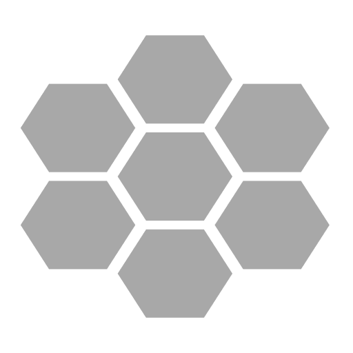

# IronHive

<p align="center">
  
</p>

<p align="center">
  <a href="https://github.com/iyulab/ironhive/actions/workflows/ci.yml">
    
  </a>
  <a href="https://www.nuget.org/packages/IronHive.Core">
    
  </a>
  <a href="https://github.com/iyulab/ironhive/blob/main/LICENSE">
    
  </a>
</p>

**IronHive**는 기업용 AI 애플리케이션을 위한 .NET 10 파이프라인 프레임워크입니다. 이름 기반 레지스트리 패턴으로 멀티 Provider LLM 통합, 멀티에이전트 오케스트레이션, RAG 파이프라인, 파일 처리를 제공합니다.

## 주요 기능

- **멀티 Provider LLM** — OpenAI, Anthropic, Google AI (Gemini/Vertex AI), OpenAI Compatible (Ollama, LM Studio, GPUStack 등)
- **모델 목록의 컨텍스트 크기** — `IModelFinder.ListModelsAsync` 가 목록 API 가 알려 주는 컨텍스트를 `LanguageModelCard.ContextWindow` 로 싣는다(Google AI `inputTokenLimit`, OpenAI Compatible 중 vLLM `max_model_len` — `OpenAICompatibleModelFinder`, 등록 시 자동). 알려 주지 않는 서버는 null
- **멀티에이전트 오케스트레이션** — `SequentialOrchestrator` · `ParallelOrchestrator` · `HubSpokeOrchestrator`(각자의 `…OrchestratorOptions` 로 생성), `HandoffOrchestratorBuilder` · `GroupChatOrchestratorBuilder` · `GraphOrchestratorBuilder`(DAG). 공통 옵션 — 타임아웃 · `StopOnAgentFailure` · 에이전트 미들웨어 · 승인 핸들러 · 컨텍스트 스코프 · 결과 distiller — 은 옵션 객체 또는 빌더의 `Set…` 으로 준다([docs/ORCHESTRATION.md](docs/ORCHESTRATION.md))
- **RAG 파이프라인** — 텍스트 추출, 청킹, 임베딩, 벡터 검색
- **다중 모달리티** — 이미지 생성, 음성 TTS/STT, 비디오 생성
- **플러그인** — MCP: `McpClientManager.AddOrUpdate(new McpHttpClientConfig{…}` / `McpStdioClientConfig{…})` 로 서버를 붙이고 세션의 도구를 에이전트 도구에 더한다(HTTP/Stdio/OAuth). OpenAPI: `new OpenApiClientManager(tools)` 에 `await AddOrUpdateAsync(client)` 로 `OpenApiClient` 를 등록하면 스펙의 연산이 그 `IToolCollection` 에 도구로 들어간다([docs/PLUGINS.md](docs/PLUGINS.md))
- **M.E.AI 호환** — 패키지 `IronHive.Extensions.AI`(의존: Abstractions 뿐 — Core 없이 provider 를 `IChatClient` 로): `generator.AsChatClient(model, provider)` · `AsEmbeddingGenerator(…)` · `AIToolAdapter`(임의의 `AITool`을 `ITool`로 래핑·실행 — MCP `McpClientTool` 등). 도구 인자 스트리밍(opt-in): `ChatOptions.AdditionalProperties[ChatClientAdapter.StreamToolArgumentsKey] = true` 이면 스트리밍 응답이 인자를 쓰이는 동안 `FunctionCallDeltaContent`(`CallId` · 첫 조각의 `Name` · `ArgumentsFragment`)로도 내고, 완전한 `FunctionCallContent` 가 뒤따른다(Chat Completions·Responses·Anthropic — Anthropic 은 이때 도구마다 `eager_input_streaming` 을 켜서 서버가 입력을 끝까지 모았다 보내지 않게 한다(`MessageGenerationRequest.StreamToolArguments`, 서버 검증 없음). Google 은 호출을 한 번에 보낸다). `using IronHive.Extensions.AI;`
- **워크플로우** — 코드 기반 타입 안전 워크플로우 엔진
- **구조화 출력** — `OutputFormat.For<T>()`/`For(schema)` 는 스키마로 구속, `OutputFormat.Json` 은 스키마 없는 JSON 모드(provider 네이티브 JSON 모드로 번역 — OpenAI `json_object`, Gemini `responseMimeType`, Anthropic 은 시스템 지시). `AgentInvokeOptions.OutputFormat` 또는 `IChatClient` 의 `ChatOptions.ResponseFormat` 으로 켠다
- **도구 결과 합계 예산** — `ToolResultBudgetMiddleware`가 한 호출의 도구 루프 전체에서 모델에 보내는 결과 텍스트 합계를 제한(작은 문맥 창 대응, [docs/TOOLS.md](docs/TOOLS.md))
- **공급자 고유 필드** — `MessageRequest.ExtraBody`(임베딩은 `EmbeddingRequestOptions.ExtraBody`, `EmbedBatchAsync(model, inputs, options)`) 가 요청 본문에 합쳐지고, 매핑되지 않은 응답 필드(예: llama.cpp `timings`)가 `MessageResponse.ExtraBody` 로 돌아온다(OpenAI Compatible, [docs/PROVIDERS.md](docs/PROVIDERS.md))
- **게이트웨이 자격증명 형태** — OpenAI 와이어(OpenAI · OpenAI Compatible · GPUStack)의 키 슬롯이 `ApiKeyPlacement`(`CredentialPlacement.Authorization("Basic")` · `.Authorization(null)` · `.InHeader("api-key")`, 기본 `Bearer`)로 키를 보낼 헤더와 scheme 을 정한다 — 키는 계속 `ApiKey`/`ApiKeyResolver` 에 있다([docs/PROVIDERS.md](docs/PROVIDERS.md))
- **토큰 로그 확률** — `MessageRequest.LogProbabilities`(상위 대안 0~20)로 출력 토큰별 로그 확률을 받는다(`MessageResponse.LogProbabilities`, 스트리밍 done 프레임에도; OpenAI Compatible · Google AI, [docs/PROVIDERS.md](docs/PROVIDERS.md))
- **도메인 예외** — 컨텍스트 윈도우 초과 시 프로바이더별 오류를 `ContextOverflowException`(`ContextWindow`·`RequestTokens` 포함)으로 정규화 — 문자열 파싱 없이 `catch`로 압축·복구 로직 작성 가능. 프로바이더 대신 자기 OpenAI SDK 클라이언트(또는 `Microsoft.Extensions.AI.OpenAI`)를 쓰는 경우 `OpenAIErrors.TryMapContextOverflow(ex)`/`TryMapRateLimit(ex)`(`IronHive.Providers.OpenAI`)로 같은 매핑을 받는다. OpenAI 호환 클라이언트(`IronHive.Providers.OpenAI.Compatible`)의 그 밖의 HTTP 오류는 `ProviderHttpException` — `HttpRequestException`(같은 `StatusCode`)이면서 서버가 보낸 `Retry-After`/`retry-after-ms` 를 `RetryAfter` 로 싣는다(503 + 힌트 = «기다려라», 힌트 없음 = 다른 곳으로)

## 왜 IronHive인가

2026년 4월 Microsoft Agent Framework 1.0이 AutoGen과 Semantic Kernel을 통합해 GA로 출시되며 .NET LLM 오케스트레이션의 유력한 기본 선택지로 떠올랐습니다. IronHive는 이와 다른 설계 축을 선택합니다 — **로컬 우선, 클라우드 무의존**입니다.

- **완전한 로컬 추론 루프** — [lm-supply](https://github.com/iyulab/lm-supply)로 LLM 생성·임베딩·리랭킹·OCR까지 GGUF/ONNX 백엔드로 순수 .NET에서 실행합니다. 클라우드 계정이나 네트워크 연결 없이도 에이전트 루프 전체가 동작합니다.
- **네이티브 .NET, 브리지 불필요** — Microsoft Agent Framework의 로컬 실행 경로(Foundry Local)는 2026년 기준 Python 전용이며, .NET에서 쓰려면 커뮤니티 어댑터를 거쳐야 합니다. IronHive는 로컬 추론이 처음부터 .NET 1급 시민입니다.
- **RAG 파이프라인 내장** — 문서 처리([FileFlux](https://github.com/iyulab/FileFlux)/[WebFlux](https://github.com/iyulab/WebFlux))부터 하이브리드 검색([FluxIndex](https://github.com/iyulab/FluxIndex))까지 별도 통합 없이 바로 사용합니다.

Azure 생태계에 이미 투자한 팀이라면 Microsoft Agent Framework가 자연스러운 선택입니다. 오프라인/에어갭 환경, 데이터 상주 요구사항, 또는 클라우드 종속을 피하려는 .NET 애플리케이션이라면 IronHive가 그 자리를 채웁니다.

## 설치

```bash
dotnet add package IronHive.Core
dotnet add package IronHive.Providers.OpenAI    # 또는 Anthropic, GoogleAI 등
```

## 빠른 시작

### Standalone (콘솔)

```csharp
using IronHive.Core;
using IronHive.Providers.OpenAI;
using IronHive.Abstractions.Messages.Content;

var hive = new HiveServiceBuilder()
    .AddOpenAIProviders("openai", new OpenAIConfig { ApiKey = "your-api-key" })
    .Build();

var agent = hive.CreateAgentFrom(cfg =>
{
    cfg.Provider = "openai";
    cfg.Model = "gpt-4o-mini";
    cfg.Instructions = "당신은 친절한 도우미입니다.";
});

// 단순 텍스트 호출
var response = await agent.InvokeAsync("안녕하세요");

// per-request 옵션 (에이전트 기본값 위에 이 호출에만 overlay)
var response2 = await agent.InvokeAsync("안녕하세요", new AgentInvokeOptions
{
    ThinkingEffort = MessageThinkingEffort.High,
    ThinkingOutput = MessageThinkingOutput.Summary,  // 추론 요약을 응답에 싣기 (None 이면 숨김)
    Suggestions = new SuggestionOptions(),  // 후속 질의 제안 활성화
    MaxTokens = 2048,
});

// 스트리밍
await foreach (var chunk in agent.InvokeStreamingAsync("안녕하세요"))
{
    // chunk 처리
}
```

### ASP.NET Core DI 통합

```csharp
// Program.cs
builder.Services.AddHiveService((hiveBuilder, sp) =>
    hiveBuilder
        .AddOpenAIProviders("openai", new OpenAIConfig
        {
            ApiKey = builder.Configuration["OpenAI:ApiKey"]!
        })
        .Build());

// 서비스에서 IHiveService 주입
public class ChatService(IHiveService hive)
{
    public async Task<string> ChatAsync(string text)
    {
        var agent = hive.CreateAgentFrom(cfg =>
        {
            cfg.Provider = "openai";
            cfg.Model = "gpt-4o-mini";
        });
        var response = await agent.InvokeAsync(text);
        return response.Message?.Content
            .OfType<TextMessageContent>()
            .FirstOrDefault()?.Value ?? string.Empty;
    }
}
```

## 패키지

| 패키지 | 설명 |
|--------|------|
| `IronHive.Abstractions` | 인터페이스 및 계약 (외부 의존 없음) |
| `IronHive.Core` | 핵심 구현 (에이전트, 오케스트레이터, 워크플로우) |
| `IronHive.Extensions.AI` | provider 를 Microsoft.Extensions.AI `IChatClient` / `IEmbeddingGenerator` 로 — Abstractions 만 의존(Core 불필요) |
| `IronHive.Providers.OpenAI` | OpenAI / Azure OpenAI / xAI (Responses API, Embeddings, DALL-E, TTS/STT) |
| `IronHive.Providers.Anthropic` | Anthropic Claude |
| `IronHive.Providers.GoogleAI` | Google Gemini + Vertex AI (이미지, 비디오, 오디오 포함) |
| `IronHive.Providers.OpenAI.Compatible` | Ollama, LM Studio, vLLM, llama.cpp, GPUStack 등 — Chat Completions 표면 |
| `IronHive.Storages.Qdrant` | Qdrant 벡터 데이터베이스 |
| `IronHive.Storages.Amazon` | Amazon S3 파일 저장소 |
| `IronHive.Storages.Azure` | Azure Blob / File Share |
| `IronHive.Storages.RabbitMQ` | RabbitMQ 큐 |
| `IronHive.Plugins.MCP` | Model Context Protocol (HTTP/Stdio/OAuth) |
| `IronHive.Plugins.OpenAPI` | OpenAPI 도구 자동 생성 |

> **출력 길이 파라미터 선택 (0.16.0~)** — OpenAI 가 `max_tokens` 를 `max_completion_tokens` 로
> 개명하면서 생태계가 갈렸다. 최신 OpenAI 모델은 구 이름을 **거부**하고, 다수의 self-hosted 서버는
> 새 이름을 **모른 채 무시**한다 — 모르는 필드는 오류가 아니라 침묵이므로, 상한이 조용히 사라지고
> 증상은 "응답이 예상보다 길다" 뿐이다. 어디서나 통하는 이름이 없어 **선택지로 제공**한다:
>
> ```csharp
> var config = new OpenAICompatibleConfig
> {
>     BaseUrl = "http://localhost:11434",
>     TokenLimitParameter = TokenLimitParameter.MaxTokens   // 구 이름만 아는 서버
> };
> ```
>
> 기본값은 `MaxCompletionTokens` — 종전 동작 그대로라 기존 설정은 영향받지 않는다. `Both` 는 둘 다
> 받아들이는 엔드포인트에서만 쓴다(구 이름을 거부하는 곳에서는 요청 전체가 실패한다).
> `MaxTokens` 를 지정하지 않으면 어느 설정에서도 두 필드 모두 전송되지 않는다.

> **`localhost` 와 연결 타임아웃 (0.41.0~)** — 각 provider 가 직접 만드는 전송은 호스트의 주소들을 경주시킨다
> (RFC 8305): `localhost` 가 `::1` 부터 풀려도 IPv4 전용 로컬 서버(llama-server · Ollama 기본값)에 곧바로 붙는다.
> 그 전에는 Windows 에서 거부된 IPv6 연결이 약 2 초 걸려 OpenAI-compatible 의 2 초 `ConnectTimeout` 이 먼저 끝났다.
> `HttpClient` 를 직접 주입하는 경우 같은 동작은 `IronHive.Abstractions.Http.ProviderConnect.CreateHandler(timeout)` 로 얻는다.
> OpenAI-compatible · GPUStack 의 기본 `ConnectTimeout` 은 0.46.1 부터 3 초다 — Windows 가 거부된 연결을 알리는 ~2 초보다 길어야 꺼진 서버가 타임아웃이 아니라 거부로 보고된다.

> **스트림 idle 타임아웃 `StreamIdleTimeout` (0.51.0~)** — 모든 provider config 에 있다. 스트리밍 응답이 이 시간보다 오래
> 침묵하면(첫 이벤트 전, 또는 이벤트 사이) `TimeoutException`(«stream idle timeout»)으로 끝난다. 전체 요청 시한과 달리
> 느린 스트림(긴 프롬프트 평가 뒤 흐르는 답변)과 죽은 스트림을 가른다 — 로컬 서버라면 첫 토큰 전 평가 시간보다 크게.
> 기본 무제한. `OpenAICompatibleConfig` · `GpuStackConfig` 는 이 버전부터 `Timeout` 도 갖는다. 같은 예산을 직접 쓰려면
> `IronHive.Abstractions.Http.ProviderStreams.WithIdleTimeout`. 상세: [docs/PROVIDERS.md](docs/PROVIDERS.md) 「스트림 idle 타임아웃」.

> **도구 이미지 운반 `CarryImageToolResultsAsUserMessage` (0.49.0~)** — Chat Completions 의 `tool` 메시지는 텍스트만
> 담고, OpenAI 호환 서버(vLLM · llama.cpp)는 그 자리의 이미지 part 를 거부한다. 기본(꺼짐)은 종전대로 이미지를 자리표시
> 한 줄로 바꾼다. 켜면 도구 메시지는 텍스트와 `[image image/png — attached in the next message]` 를 갖고, 그 라운드의 도구
> 메시지들 뒤 user 메시지 하나가 이미지를 싣는다 — 로컬 vision 모델이 MCP 도구가 그린 그림을 보는 경로다.
>
> ```csharp
> var config = new OpenAICompatibleConfig { BaseUrl = "http://127.0.0.1:8080", CarryImageToolResultsAsUserMessage = true };
> ```

> **SDK 재시도 횟수 `MaxRetries` (0.46.0~)** — `OpenAIConfig` · `OpenAICompatibleConfig` · `GpuStackConfig` · `AnthropicConfig`
> 가 같은 이름·의미를 갖는다: 실패한 요청(전송 실패 · 408 · 429 · 5xx)을 SDK 가 몇 번 다시 보내는가. `null` 은 SDK 기본값
> (OpenAI 계열 3회 = 최대 4 요청), `0` 은 한 번만 보낸다. 연결 확인처럼 즉답이 필요하거나 `RetryMiddleware` 로 직접 재시도하는
> 곳에서는 `0` 으로 둬야 재시도가 곱해지지 않는다.

## 문서

| 문서 | 설명 |
|------|------|
| [docs/ARCHITECTURE.md](docs/ARCHITECTURE.md) | 시스템 아키텍처 및 설계 원칙 |
| [docs/SETUP.md](docs/SETUP.md) | HiveServiceBuilder 구성 및 DI 통합 |
| [docs/AGENTS.md](docs/AGENTS.md) | 에이전트 생성 및 호출 |
| [docs/MIDDLEWARE.md](docs/MIDDLEWARE.md) | 미들웨어 시스템 (Retry, Timeout, CircuitBreaker 등) |
| [docs/ORCHESTRATION.md](docs/ORCHESTRATION.md) | 멀티에이전트 오케스트레이션 패턴 |
| [docs/TOOLS.md](docs/TOOLS.md) | FunctionTool 및 커스텀 도구 |
| [docs/MEMORY.md](docs/MEMORY.md) | RAG 파이프라인 및 MemoryWorker |
| [docs/PROVIDERS.md](docs/PROVIDERS.md) | AI 프로바이더 설정 |
| [docs/STORAGES.md](docs/STORAGES.md) | 스토리지 백엔드 설정 |
| [docs/PLUGINS.md](docs/PLUGINS.md) | MCP / OpenAPI 플러그인 |
| [docs/SERVICES.md](docs/SERVICES.md) | IHiveService 서비스 상세 |

## Skills (AI 코딩 에이전트용)

AI 코딩 에이전트(GitHub Copilot, Claude Code, Cursor 등)에서 IronHive Skills를 사용하려면:

```bash
npx skills add iyulab/ironhive
```

설치 후 에이전트가 IronHive API 패턴, 오케스트레이션, RAG 파이프라인, 툴 사용법을 자동으로 인식합니다.

## 요구 사항

- .NET 10.0+

## 라이선스

MIT — [LICENSE](./LICENSE) 참조.
