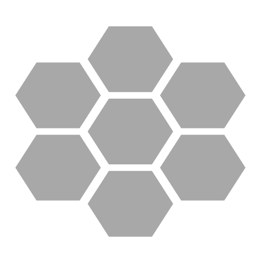

# IronHive

<p align="center">
  
</p>

<p align="center">
  <a href="https://github.com/iyulab/ironhive/actions/workflows/ci.yml">
    
  </a>
  <a href="https://www.nuget.org/packages/IronHive.Core">
    
  </a>
  <a href="https://github.com/iyulab/ironhive/blob/main/LICENSE">
    
  </a>
</p>

**IronHive**는 기업용 AI 애플리케이션을 위한 .NET 파이프라인 프레임워크입니다. 멀티 Provider LLM 통합, 벡터 기반 RAG 파이프라인, 멀티에이전트 오케스트레이션, 파일 처리를 Fluent Builder API로 제공합니다.

범용 프레임워크가 필요하다면 [Semantic Kernel](https://github.com/microsoft/semantic-kernel) 또는 [Agent Framework](https://github.com/microsoft/agent-framework)를 권장합니다.

## 주요 기능

- **멀티 Provider LLM** — OpenAI, Anthropic, Google AI, Ollama
- **멀티에이전트 오케스트레이션** — Sequential, Parallel, Hub-Spoke, Graph (DAG)
- **RAG 파이프라인** — 텍스트 추출, 청킹, 임베딩, 벡터 검색
- **파일 처리** — PDF, Word, PowerPoint, 이미지
- **플러그인** — MCP, OpenAPI 통합
- **M.E.AI 호환** — `ChatClientAdapter` / `EmbeddingGeneratorAdapter`

## 설치

```bash
dotnet add package IronHive.Core
dotnet add package IronHive.Providers.OpenAI    # 또는 Anthropic, GoogleAI, Ollama
```

## 빠른 시작

```csharp
using IronHive.Core;
using IronHive.Providers.OpenAI;

var hive = new HiveServiceBuilder()
    .AddMessageGenerator("openai", new OpenAIMessageGenerator(new OpenAIConfig
    {
        ApiKey = "your-api-key"
    }))
    .Build();

var agent = hive.CreateAgent(config =>
{
    config.Provider = "openai";
    config.Model = "gpt-4o";
    config.SystemPrompt = "You are a helpful assistant.";
});

var response = await agent.InvokeAsync(messages);

// 스트리밍
await foreach (var chunk in agent.InvokeStreamingAsync(messages))
{
    Console.Write(chunk.Content);
}
```

## 패키지

| 패키지 | 설명 |
|--------|------|
| `IronHive.Abstractions` | 인터페이스 및 계약 |
| `IronHive.Core` | 핵심 구현 |
| `IronHive.Providers.OpenAI` | OpenAI / Azure OpenAI / xAI / GPUStack |
| `IronHive.Providers.Anthropic` | Claude 모델 |
| `IronHive.Providers.GoogleAI` | Gemini 모델 |
| `IronHive.Providers.Ollama` | 로컬 LLM (Ollama, LM Studio) |
| `IronHive.Storages.Qdrant` | Qdrant 벡터 데이터베이스 |
| `IronHive.Storages.Amazon` | Amazon S3 파일 저장소 |
| `IronHive.Storages.Azure` | Azure Blob / Service Bus |
| `IronHive.Storages.RabbitMQ` | RabbitMQ 큐 |
| `IronHive.Plugins.MCP` | Model Context Protocol |
| `IronHive.Plugins.OpenAPI` | OpenAPI 도구 통합 |

## 문서

- [아키텍처](docs/ARCHITECTURE.md) — 시스템 설계, 의존성 그래프, 확장 패턴
- [설계 노트](docs/DESIGN.md) — Builder/Service API, 오케스트레이션 패턴
- [프로젝트 구조](docs/STRUCTURE.md) — 서비스 분류 및 생명주기

## 요구 사항

- .NET 10.0+

## 라이선스

MIT — [LICENSE](./LICENSE) 참조.
